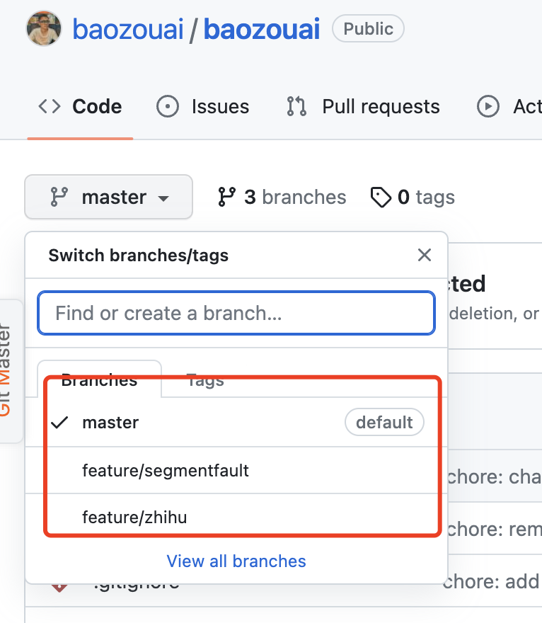
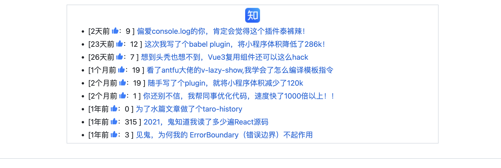

<p align="center">
<h1 align="center">multi-platform-posts-action</h1>
</p>

<div align="center">
  Synchronize recent articles from different platforms to the github homepage, support Juejin, Zhihu, and Segmentfault.

<br/>
<br/>

![ci][ci-badge]

[ci-badge]: https://github.com/baozouai/multi-platform-posts-action/actions/workflows/ci.yml/badge.svg

English | [中文](./README.md)

</div>


## 💡 Source Of Inspiration
Inspired by 👉 [KunLunXu-CC/juejin-posts-action](https://github.com/KunLunXu-CC/juejin-posts-action) , but found that only generated article links, does not support the number of likes , number of favorites, multi-platform and other functions, so implement one by yourself.

## ✨Features

- Multi-platform, currently supports **Juejin, Zhihu, and Segmentfault** (I had already made Yuque, but found that the interface of Yuque was very strange, and I couldn't get the correct article link, so I temporarily canceled the support of Yuque function)
  
- Support generating icons for different platforms  
- Support likes 👍🏻
- Support the number of favorites ⭐ (currently only juejin has it, the interface of Zhihu and Segmentfault is more troublesome, so I won’t do it for the time being)
 ## 🔨 Usage

1. Add flags anywhere in `README`

```markdown
<!-- multi-platform-posts start -->
The list of generated articles will be inserted here
<!-- multi-platform-posts end -->
```

2. Get the id of different platforms, fill in the user_id of baozouai/multi-platform-posts-action@main below

   - Juejin：

   - Zhihu

   <!--- Yuque -->

   - segmentfault 

     

2. Setting github workflow（can refer to my [update_readme.yml](https://github.com/baozouai/baozouai/blob/master/.github/workflows/update_readme.yml))

```yaml
# workflow name
name: Update Readme

# Workflow trigger timing, see: https://docs.github.com/zh/actions/using-workflows/triggering-a-workflow
# The trigger condition is changed to: when the main branch has a push operation || every day at 0:00
on:
  schedule:
    - cron: '30 22 * * *'
  push:
    branches:
      - master
      - feature/zhihu
      - feature/segmentfault

# jobs, see: https://docs.github.com/zh/actions/using-jobs/using-jobs-in-a-workflow
jobs:

  # Insert nugget list, use baozouai/multi-platform-posts-action to generate post list, see: https://github.com/baozouai/multi-platform-posts-action
  juejin-posts:
    runs-on: ubuntu-latest
    steps:
      - name: Checkout
        uses: actions/checkout@v3

      - name: Append Juejin Posts List 📚
        uses: baozouai/multi-platform-posts-action@main
        with:
          user_id: '3526889034488174' # After getting the id of different platforms above, fill in here
          platform: juejin # Fill in different platforms here, including juejin, zhihu, segmentfault

      - run: |
          git pull
      - name: Push to GitHub
        uses: EndBug/add-and-commit@v9
        with:
          default_author: github_actions
          message: juejin-posts
```

4. Trigger workflow and automatically synchronize articles

After the above configuration is completed, the action will be triggered after the push, and then the corresponding platform will generate the corresponding icon, time, number of likes, number of favorites, and article links. Examples are as follows：



- Juejin


- Zhihu



- segmentfault


## 📄 LICENSE

multi-platform-posts-action is [MIT 协议](./LICENSE).