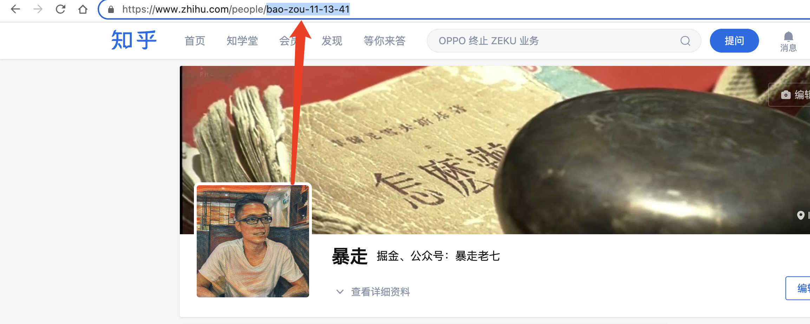
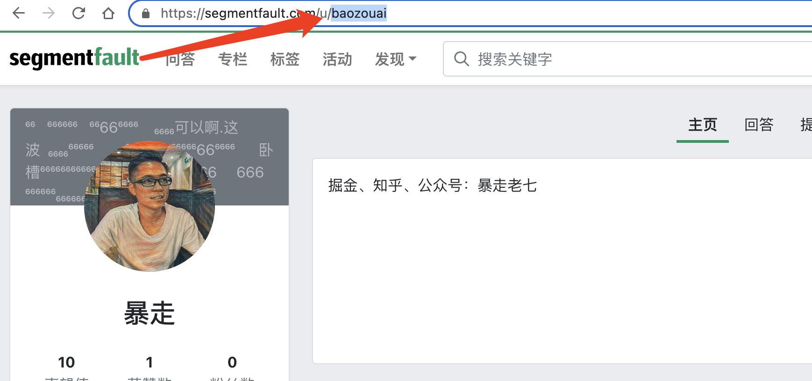
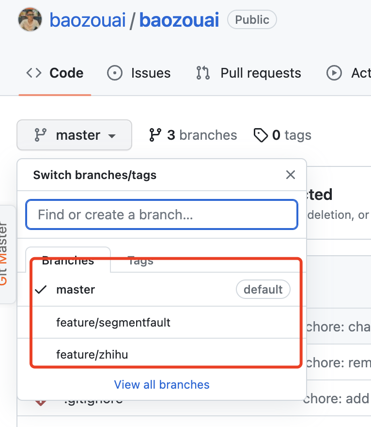
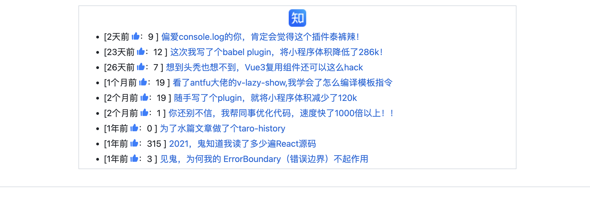
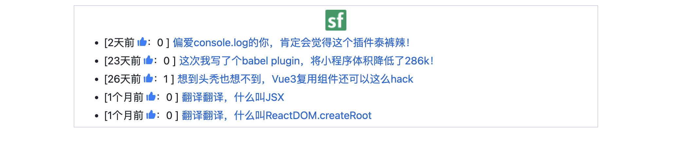

<p align="center">
<h1 align="center">multi-platform-posts-action</h1>
</p>

<div align="center">
  同步不同平台的最近文章到github首页，支持掘金、知乎、思否

<br/>
<br/>

![ci][ci-badge]

[ci-badge]: https://github.com/baozouai/multi-platform-posts-action/actions/workflows/ci.yml/badge.svg


中文 | [English](./README%20_EN.md)

</div>


## 💡 灵感来源
受到 👉 [KunLunXu-CC/juejin-posts-action](https://github.com/KunLunXu-CC/juejin-posts-action) 的启发，但用了发现只生成了文章链接，不支持点赞数、收藏数、多平台等功能，所以自己实现一个。

## ✨功能

- 多平台，目前支持**掘金、知乎、思否**（本来做好了语雀的，但发现语雀接口很奇怪，没法拿到正确的文章链接，所以暂时取消支持语雀的功能）
- 支持生成不同平台的 icon  
- 支持点赞数 👍🏻
- 支持收藏数 ⭐（目前只有掘金有，知乎、思否接口比较麻烦，暂且不做）
 ## 🔨 使用

1. 在 `README` 中任意位置添加标志位

```markdown
<!-- multi-platform-posts start -->
这里会插入生成的文章列表
<!-- multi-platform-posts end -->
```

2. 拿到不同平台的id，填入下面的baozouai/multi-platform-posts-action@main的user_id

   - 掘金：

   - 知乎

   <!--- 语雀 -->

   - 思否 

     

2. 设置工作流（[可参照我的](https://github.com/baozouai/baozouai/blob/master/.github/workflows/update_readme.yml))

```yaml
# 工作流名称
name: Update Readme

# 工作流触发时机, see: https://docs.github.com/zh/actions/using-workflows/triggering-a-workflow
# 触发条件修改为: 当 main 分支有 push 操作 || 每天 0 点
on:
  schedule:
    - cron: '30 22 * * *'
  push:
    branches:
      - master
      - feature/zhihu
      - feature/segmentfault

# 作业, see: https://docs.github.com/zh/actions/using-jobs/using-jobs-in-a-workflow
jobs:

  # 插入掘金列表, 使用 baozouai/multi-platform-posts-action 生成文章列表, see: https://github.com/baozouai/multi-platform-posts-action
  juejin-posts:
    runs-on: ubuntu-latest
    steps:
      - name: Checkout
        uses: actions/checkout@v3

      - name: Append Juejin Posts List 📚
        uses: baozouai/multi-platform-posts-action@main
        with:
          user_id: '3526889034488174' # 上面拿到不同平台的id后，填入这里
          platform: juejin # 这里填写不同的平台，有juejin, zhihu, segmentfault

      - run: |
          git pull
      - name: Push to GitHub
        uses: EndBug/add-and-commit@v9
        with:
          default_author: github_actions
          message: juejin-posts
```

4. 触发工作流，自动同步文章

上面配置完成后，push 后就会触发 action，然后对应平台就会生成相应的 icon、时间、点赞数、收藏数、文章链接，例子如下：



- 掘金


- 知乎



- 思否


## 📄 协议

multi-platform-posts-action 遵循 [MIT 协议](./LICENSE).